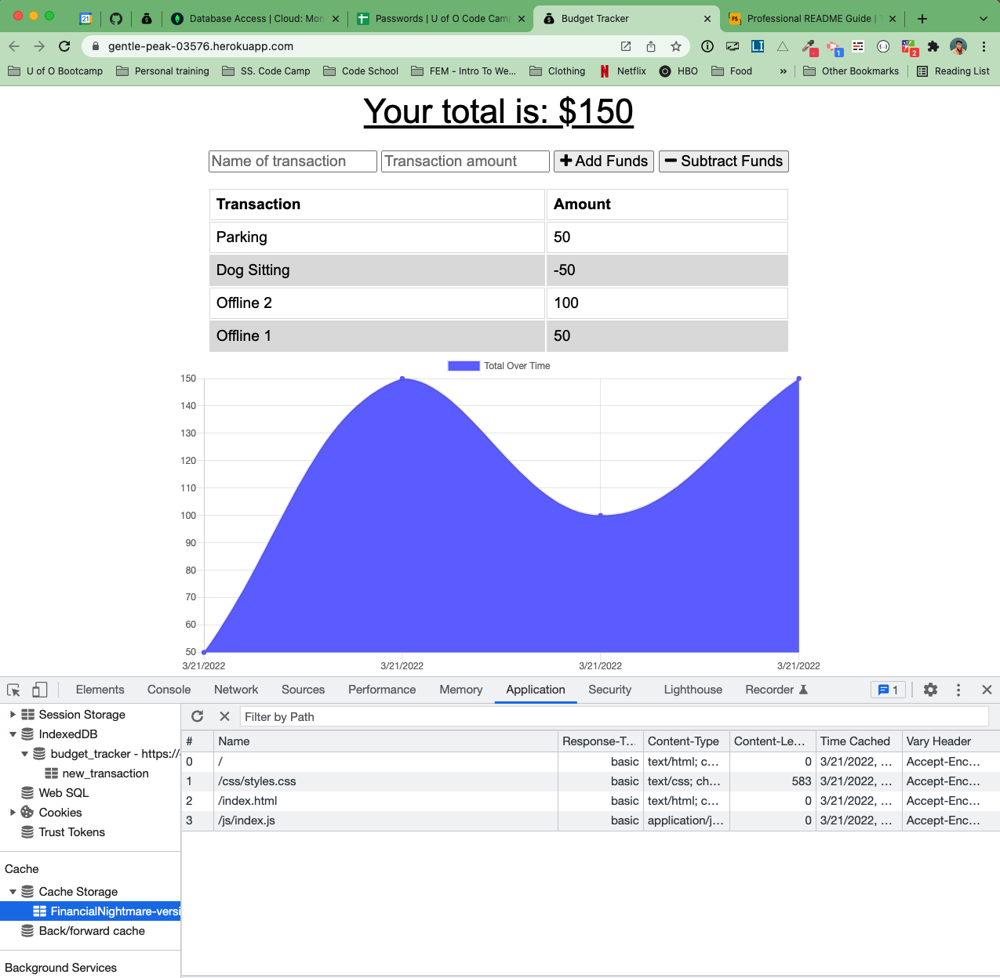

# Financial Nightmare aka Budget Tracker

## Description

This app allows a user to add and subtract expenses over time. Useing MongoDB and PWA concepts this app also works when a user is offline. They can add and subtract transactions while their app is offline due to an Indexed DB and Service Workers, as well as a Manifest file.

## Table of Contents

If your README is long, add a table of contents to make it easy for users to find what they need.

- [Installation](#installation)
- [Usage](#usage)
- [Credits](#credits)
- [License](#license)

## Installation

Should you decide to download this repo to run locally follow these steps:

1. Clone the Repo to your computer
2. Run `npm i` to install dependencies
3. Run `npm start` 
4. View the site locally at localhost:3001

## Usage

Financial Nightmare is visible and deployed at https://gentle-peak-03576.herokuapp.com/ 

  
    

## Credits

[MongoDb](https://www.mongodb.com/)  
[Mongoose](https://mongoosejs.com/)  
[Express](https://expressjs.com/)

## License

MIT License

Copyright (c) [2022] [Emily Dokken]

Permission is hereby granted, free of charge, to any person obtaining a copy
of this software and associated documentation files (the "Software"), to deal
in the Software without restriction, including without limitation the rights
to use, copy, modify, merge, publish, distribute, sublicense, and/or sell
copies of the Software, and to permit persons to whom the Software is
furnished to do so, subject to the following conditions:

The above copyright notice and this permission notice shall be included in all
copies or substantial portions of the Software.

THE SOFTWARE IS PROVIDED "AS IS", WITHOUT WARRANTY OF ANY KIND, EXPRESS OR
IMPLIED, INCLUDING BUT NOT LIMITED TO THE WARRANTIES OF MERCHANTABILITY,
FITNESS FOR A PARTICULAR PURPOSE AND NONINFRINGEMENT. IN NO EVENT SHALL THE
AUTHORS OR COPYRIGHT HOLDERS BE LIABLE FOR ANY CLAIM, DAMAGES OR OTHER
LIABILITY, WHETHER IN AN ACTION OF CONTRACT, TORT OR OTHERWISE, ARISING FROM,
OUT OF OR IN CONNECTION WITH THE SOFTWARE OR THE USE OR OTHER DEALINGS IN THE
SOFTWARE.